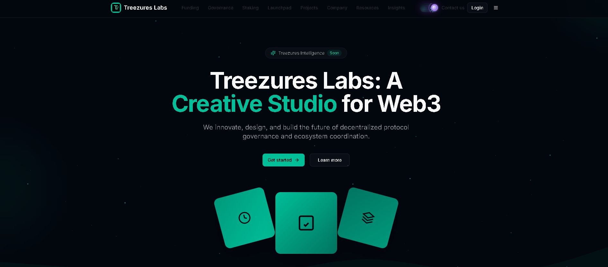
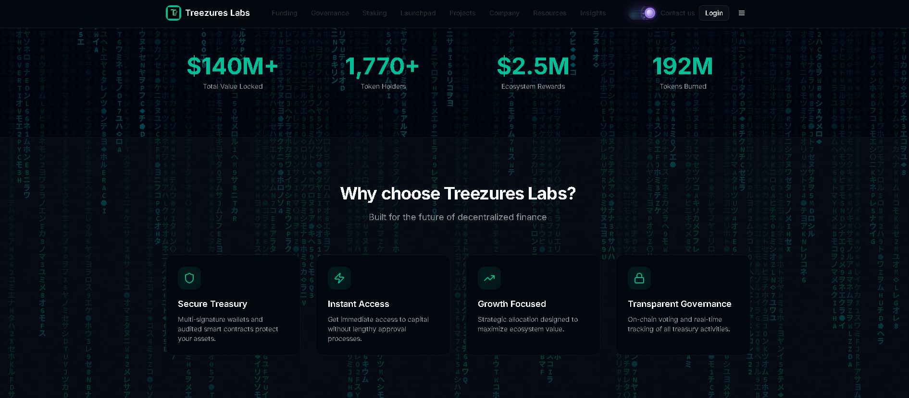
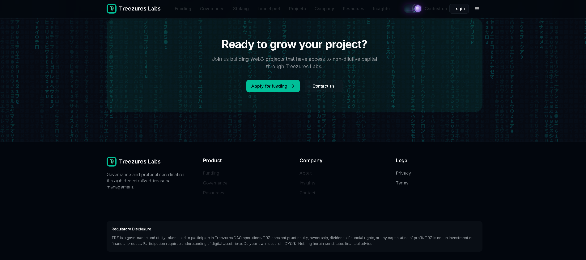
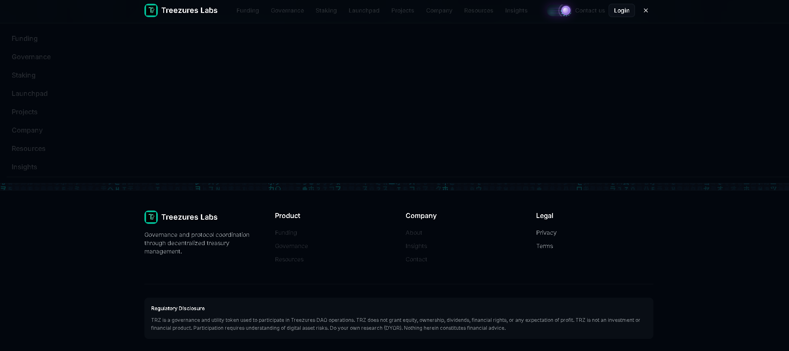

<div align="center">

# DeFi Token Launchpad

**A developer lab and token launchpad with staking, cover, and DAO governance**

[](https://nextjs.org)
[](https://www.typescriptlang.org)
[](https://tailwindcss.com)
[]()
[]()

*Stake TRZ for tiered access, launch tokens with built-in cover, and govern through a multisig that hands off to a DAO.*

</div>

> **Available for development and custom work.** This is a working prototype / showcase. I can build and deliver the complete product - including the private production backend - or adapt it for your needs, under a development agreement (post-agreement fee). **Get in touch:** https://github.com/plinkdev1


---

## What Is This?

TreeZures Labs is a developer lab and token launchpad. Holders stake the TRZ token for tiered access, projects launch with optional embedded DeFi cover, and the treasury runs multisig-first with a path to DAO governance secured by zk proof-of-humanity voting.

> **Stake. Launch. Cover. Govern.**

---

## Features

| Feature | Description | Status |
|---|---|:---:|
| Dev lab / dashboard | Project workspace and analytics | ✅ |
| Tiered TRZ staking | Builder / Pro / DAO access tiers | 🚧 |
| Token launchpad | Token launches with built-in safeguards | 🚧 |
| Multisig treasury | Multisig-controlled, transitioning to DAO | 🚧 |
| Embedded DeFi cover | Nexus Mutual / OpenCover integration | Roadmap |
| zk proof-of-humanity | Sybil-resistant governance voting | Roadmap |

---

## How It Works

```
TRZ stakers ──▶ tiered access (Builder · Pro · DAO)
     │
     ▼
Launchpad ──▶ token launches + embedded DeFi cover (Nexus Mutual / OpenCover)
     │
     ▼
Multisig ──▶ DAO governance (zk proof-of-humanity voting)
```

---

## Tech Stack

| Layer | Technology |
|-------|------------|
| Frontend | Next.js, React, TypeScript |
| Styling | Tailwind CSS, shadcn/ui |
| Auth / Data | Supabase |
| Web3 | Wallet connect; Nexus Mutual / OpenCover (roadmap) |

---

## Project Structure

```
treezures-labs/
app/
   admin/
   api/
   auth/
   company/
   contact/
   dashboard/
components/
   admin/
   dashboard/
   governance/
   launchpad/
   privacy/
   projects/
docs/
   API_TOKEN_DESCRIPTORS.md
   COMPLIANCE_AUDIT_REPORT.md
   COMPLIANCE_EXECUTION_SUMMARY.md
   COMPLIANCE_IMPLEMENTATION_CHECKLIST.md
   COOKIE_CONSENT_SETUP.md
   DEPLOYMENT_SECURITY_CHECKLIST.md
hooks/
   use-mobile.ts
   use-toast.ts
lib/
   alchemy/
   supabase/
   cookie-consent.ts
   utils.ts
public/
   logos/
   apple-icon.png
   icon-dark-32x32.png
   icon-light-32x32.png
   icon.svg
   placeholder-logo.png
scripts/
   create-cookie-consent-table.sql
   validate-compliance.js
styles/
   globals.css
.env.local
.gitignore
components.json
middleware.ts
next.config.mjs
next-env.d.ts
package.json
package-lock.json
postcss.config.mjs
README.md
tsconfig.json
```

---

## Screenshots

<p align="center">
  
  
  
  
</p>

---

## Getting Started

```bash
npm install --legacy-peer-deps --ignore-scripts
npx next dev
```

Environment variables (names only - never commit real values):

```
NEXT_PUBLIC_SUPABASE_URL=
NEXT_PUBLIC_SUPABASE_ANON_KEY=
```

---

## Roadmap

- Live TRZ staking tiers
- Launchpad with embedded cover
- Multisig to DAO transition
- zk proof-of-humanity governance

---

## Notes

Shared as a portfolio artifact demonstrating product and system design. Early prototype, not a finished product.

<div align="center">

Built for builders · MIT

</div>
